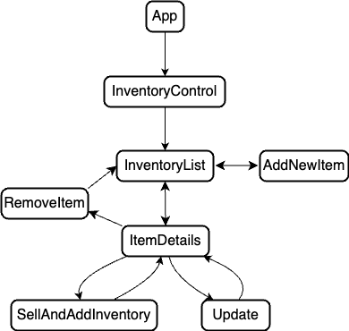

# Coffee House

## By Joseph Wilfong

# Technologies Used

* JavaScript
* JSX
* React
* Node.js
* Bootstrap

# Description

_This is a mock coffee house inventory website. It allows a user to **CRUD** coffee house items. Created with React._

# Setup/Installation Requirements

* _Clone this [repository](https://github.com/jcarenza67/Coffee-House) to your desktop_

* _Navigate to the folder that was cloned_

* _Open the project in your code editor_

* _In the terminal run `npm install` to install all dependencies_

* _In the terminal run `npm start`_

* _If the webpage doesnt automatically open, then type [http://localhost:3000](http://localhost:3000) to view it in the browser._

# Known Bugs

* _When you try to sell coffee at 0 quantity the alert window shows up twice_

# License

Permission is hereby granted, free of charge, to any person obtaining a copy of this software and associated documentation files (the “Software”), to deal in the Software without restriction, including without limitation the rights to use, copy, modify, merge, publish, distribute, sublicense, and/or sell copies of the Software, and to permit persons to whom the Software is furnished to do so, subject to the following conditions:

The above copyright notice and this permission notice shall be included in all copies or substantial portions of the Software.

THE SOFTWARE IS PROVIDED “AS IS”, WITHOUT WARRANTY OF ANY KIND, EXPRESS OR IMPLIED, INCLUDING BUT NOT LIMITED TO THE WARRANTIES OF MERCHANTABILITY, FITNESS FOR A PARTICULAR PURPOSE AND NONINFRINGEMENT. IN NO EVENT SHALL THE AUTHORS OR COPYRIGHT HOLDERS BE LIABLE FOR ANY CLAIM, DAMAGES OR OTHER LIABILITY, WHETHER IN AN ACTION OF CONTRACT, TORT OR OTHERWISE, ARISING FROM, OUT OF OR IN CONNECTION WITH THE SOFTWARE OR THE USE OR OTHER DEALINGS IN THE SOFTWARE.

_Copyright (c) 2023 Joseph Wilfong